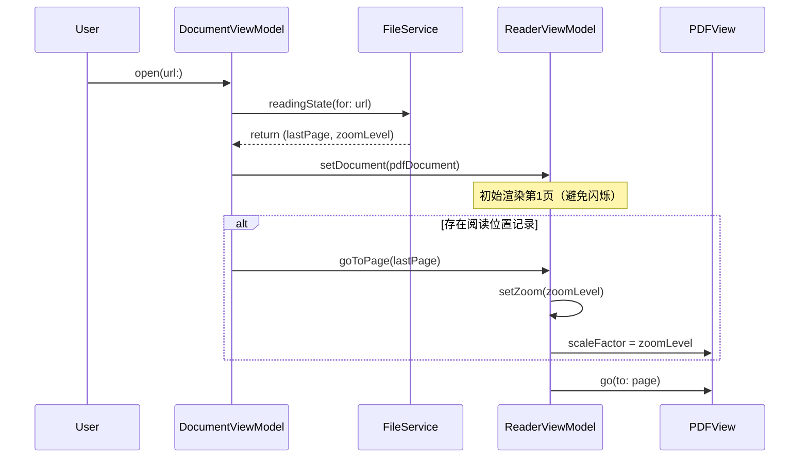

# MOD-02: PDF 渲染模块

## 文档信息

- **模块编号**: MOD-02
- **版本**: v1.0
- **更新日期**: 2026-04-01
- **对应PRD**: FR-002, FR-003, FR-014
- **对应用户故事**: US-002, US-003, US-014

---

## 系统定位

### 在整体架构中的位置

```
┌────────────────────────────────────────┐
│  L5: PDFReaderView / ToolbarView       │
│  L4: ReaderViewModel                   │
└────────────────────┬───────────────────┘
                     │ ▼ 使用
┌────────────────────▼───────────────────┐
│    ★ MOD-02: PDF 渲染模块 ★            │
│    PDFViewWrapper（NSViewRepresentable）│
│    ReaderViewModel                     │
└────────────────────┬───────────────────┘
                     │ ▼ 依赖
┌────────────────────▼───────────────────┐
│  PDFKit.PDFView / PDFDocument          │
└────────────────────────────────────────┘
```

### 核心职责

- **页面渲染**：使用 PDFKit 的 `PDFView` 渲染 PDF 页面内容
- **滚动与翻页**：响应滚轮、触控板手势、键盘事件进行翻页/滚动
- **缩放**：键盘快捷键和触控板捏合缩放，支持「适合宽度」「适合页面」两种预设模式
- **页码同步**：维护当前页码状态，双向同步（视图→状态，状态→跳转）
- **全屏模式**：进入/退出 macOS 全屏，管理工具栏/侧栏自动隐藏

### 边界说明

- **负责**：PDF 视图渲染、滚动、缩放、全屏
- **不负责**：标注渲染（AnnotationOverlayView 负责，覆盖在 PDFView 上方）、文本选择事件（传递给 MOD-05）

---

## 对应 PRD

| PRD 章节 | 编号 | 内容 |
|---------|-----|------|
| 功能需求 | FR-002 | 页面浏览与导航 |
| 功能需求 | FR-003 | 缩放 |
| 功能需求 | FR-014 | 全屏模式 |
| 用户故事 | US-002 | 浏览 PDF 页面 |
| 用户故事 | US-003 | 缩放页面 |
| 用户故事 | US-014 | 全屏阅读 |
| 验收标准 | AC-002-01~05 | 翻页所有验收条件 |
| 验收标准 | AC-003-01~07 | 缩放所有验收条件 |
| 验收标准 | AC-014-01~04 | 全屏所有验收条件 |

---

## 接口定义

### API-010: 跳转到指定页码

**对应 PRD**: AC-002-04

```swift
// ReaderViewModel
func goToPage(_ pageNumber: Int)
// 内部：clamp(1...document.pageCount)，调用 PDFView.go(to:)
```

**边界**：`pageNumber < 1` → 跳转到第 1 页；`pageNumber > pageCount` → 跳转到最后一页（AC-002-04 边界条件）

---

### API-011: 设置缩放级别

**对应 PRD**: AC-003-01 ~ AC-003-07

```swift
// ReaderViewModel
func setZoom(_ level: Double)           // 直接设置，clamp(0.1...5.0)
func zoomIn()                           // 步进 +10%（scaleFactor += 0.1）
func zoomOut()                          // 步进 -10%（scaleFactor -= 0.1）
func setZoomMode(_ mode: ZoomMode)      // .actual / .fitWidth / .fitPage

enum ZoomMode {
    case actual     // Cmd+0，100%
    case fitWidth   // Cmd+1，适合宽度
    case fitPage    // Cmd+2，适合页面
}
```

**边界**：缩放范围 `[0.1, 5.0]`（对应 10%~500%，AC-003-06）

---

### API-012: 切换全屏

**对应 PRD**: AC-014-01 ~ AC-014-04

```swift
// ReaderViewModel
func toggleFullscreen()
// 调用 NSWindow.toggleFullScreen(_:)
```

---

## 数据结构

### ReaderState（ViewModel 内部状态）

```swift
struct ReaderState {
    var currentPage: Int = 1          // 当前页码（1-indexed）
    var totalPages: Int = 0           // 总页数
    var zoomLevel: Double = 1.0       // 当前缩放比例（1.0 = 100%）
    var zoomMode: ZoomMode = .actual  // 缩放模式
    var isFullscreen: Bool = false    // 是否全屏
    var scrollPosition: CGPoint = .zero // 当前滚动位置
}
```

---

## 边界条件

### BOUND-010: 页码边界

**对应 PRD**: AC-002-04

| 输入 | 处理 |
|-----|------|
| 页码 < 1 | 跳转到第 1 页 |
| 页码 > totalPages | 跳转到最后一页 |
| 非数字输入 | 忽略，恢复显示当前页码 |

### BOUND-011: 缩放边界

**对应 PRD**: AC-003-06

| 输入 | 处理 |
|-----|------|
| zoomIn() 时已达 500% | 不响应，保持 500% |
| zoomOut() 时已达 10% | 不响应，保持 10% |
| 捏合手势超出边界 | clamp 到边界值 |

---

## UI 布局约束

### UI-Layout-001: 工具栏 (ToolbarView)

**尺寸约束**：
| 属性 | 值 | 说明 |
|-----|-----|------|
| 高度 | 固定 44pt | macOS 标准工具栏高度，不得超出 |
| 宽度 | 撑满父容器 | 随窗口宽度自适应 |

**边距**：
| 属性 | 值 |
|-----|-----|
| 水平内边距 | 16pt |
| 元素间距 (HStack) | 8pt |

**响应式规则**：
| 窗口宽度条件 | 调整行为 |
|-------------|---------|
| < 600pt | 隐藏缩放百分比文字，仅显示图标 |
| < 400pt | 隐藏页码输入框，仅显示翻页按钮 |

**布局结构**：
```
┌─────────────────────────────────────────────────────────┐
│ [←] [页码] [/总页] [→]  │  [-] [100%] [+]  │  [全屏]    │
│  ← 44pt 固定高度，内容水平居中 →                        │
└─────────────────────────────────────────────────────────┘
```

### UI-Layout-002: PDF 渲染区域 (PDFReaderView)

**尺寸约束**：
| 属性 | 值 |
|-----|-----|
| 宽度 | 撑满可用空间（减去侧边栏宽度） |
| 高度 | 撑满可用空间（减去工具栏高度 44pt） |

**边距**：
- 无内边距，PDF 内容直接填充

---

## 多步骤流程时序

### 文档打开与阅读位置恢复时序

**对应 Rule-002**: 记忆上次阅读位置



**关键设计决策**：
1. 必须先加载 PDF 再恢复位置（PDFView 需要 document）
2. 先 `goToPage` 再 `setZoom`（缩放基于当前页计算 fitWidth/fitPage）
3. 恢复过程在后台线程保存，不阻塞 UI
4. 若记录不存在，从第 1 页 100% 缩放开始

---

## 实现文件

| 文件路径 | 职责 |
|---------|------|
| `Features/Reader/PDFReaderView.swift` | SwiftUI 视图，包装 PDFViewWrapper |
| `Features/Reader/PDFViewWrapper.swift` | NSViewRepresentable，封装 PDFKit PDFView |
| `Features/Reader/ReaderViewModel.swift` | 页码/缩放/全屏状态管理 |
| `Features/Reader/ToolbarView.swift` | 工具栏（页码输入、缩放按钮） |

---

## 覆盖映射

| PRD 类型 | PRD 编号 | 架构元素 | 状态 |
|---------|---------|---------|------|
| 功能需求 | FR-002 | PDFViewWrapper, ReaderViewModel | ✅ |
| 功能需求 | FR-003 | API-011, ReaderViewModel | ✅ |
| 功能需求 | FR-014 | API-012, ReaderViewModel | ✅ |
| 用户故事 | US-002 | API-010, PDFViewWrapper | ✅ |
| 用户故事 | US-003 | API-011, BOUND-011 | ✅ |
| 用户故事 | US-014 | API-012 | ✅ |
| 验收标准 | AC-002-04 | BOUND-010 | ✅ |
| 验收标准 | AC-003-06 | BOUND-011 | ✅ |
| 验收标准 | AC-003-01~07 | API-011 | ✅ |
| 验收标准 | AC-014-01~04 | API-012 | ✅ |
